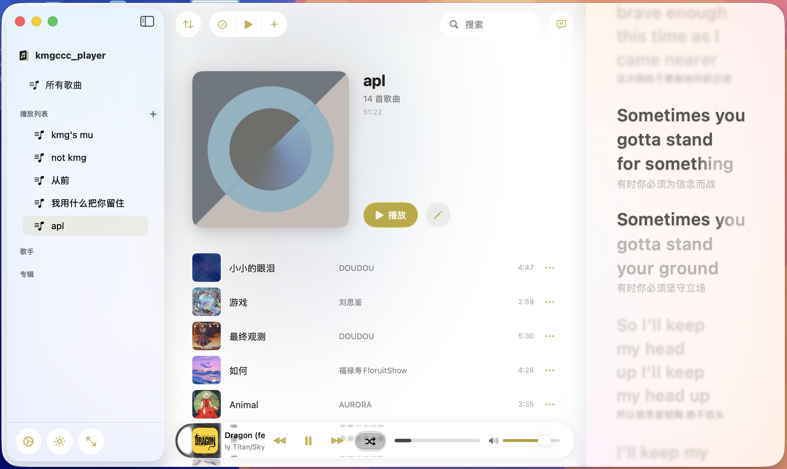
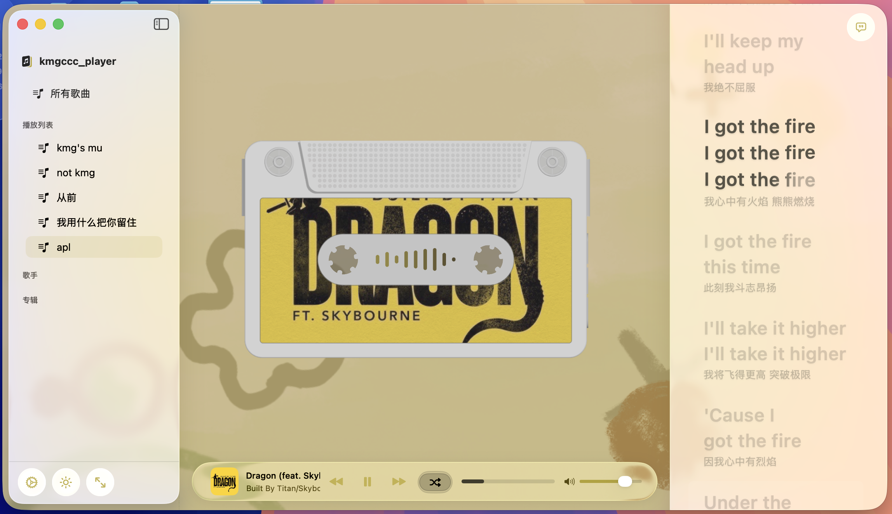
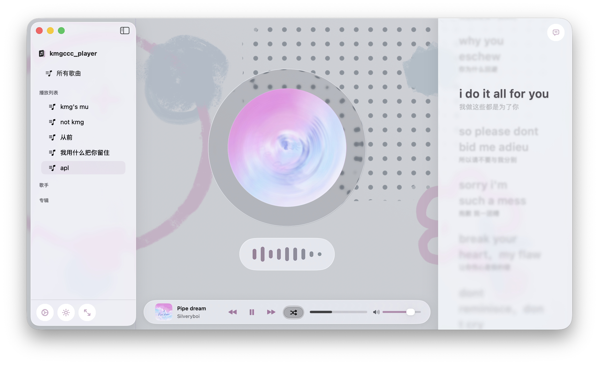
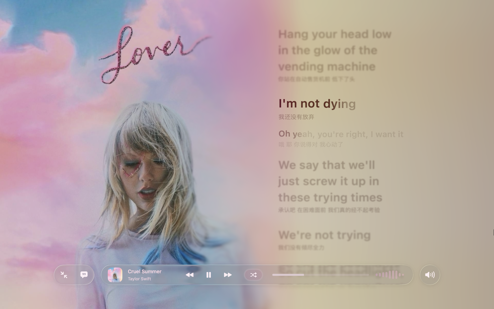
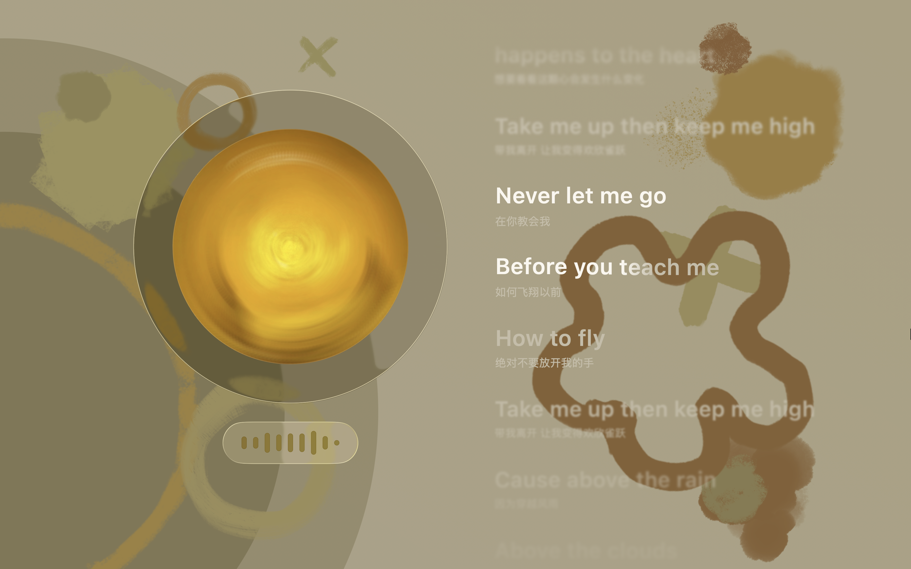
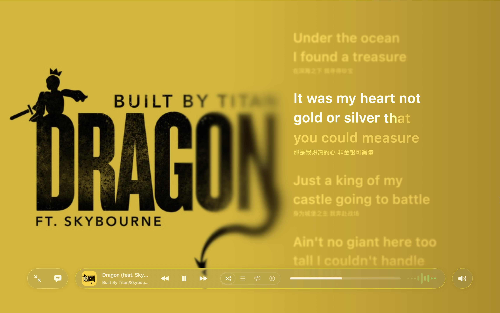

  

<h1 align="center">kmgccc_player</h1>

  面向 <strong>macOS 26</strong> 的本地音乐播放器 
  原生开发、专注美学，致力于沉浸式且富有特色的播放体验

> [!WARNING]
> kmgccc_player 为个人项目，可能存在 Bug、未完成特性或行为变动。  
> 不建议在重要环境中作为唯一播放器使用，欢迎通过 Issue 反馈问题。也欢迎提出你的意见和创意～
> 代码使用 AI 生成，可能存在问题。

## 特性
- ### **Liquid Glass 风格**  
  应用整体使用 Liquid Glass 设计语言，贴近原生系统体验
  
   

- ### **磁带式播放界面 + 实时频谱可视化 + CD 模拟旋转 **  
  加入独立的"正在播放"视图，采用磁带外观设计。  
  磁带轮会随音乐播放实时转动，并基于音频频谱算法将音乐能量映射到磁带与指示元素上，在现代界面中保留实体播放设备的仪式感。
  
  
 

- ### **全屏播放体验**  
  全新的全屏播放界面，多种皮肤切换、频谱可视化与歌词视图的顺畅协作，带来更沉浸的聆听方式。

   
  
   

- ### **艺术背景 (Beta)**  
  将当前播放曲目的封面色彩进行风格化解析与图案拼贴展示，作为"正在播放"视图的动态背景。通过提取封面色彩特征，提供更具沉浸感的视觉反馈。
  
  

- ### **AMLL 歌词组件集成**  
  集成 **AppleMusic-Like Lyrics (AMLL)** 歌词渲染组件，支持高质量逐行歌词显示与平滑滚动效果，同时加入动态封面取色，加强歌词表现力。
  
  

- ### **便捷的本地音乐资料库**  
  集成 **LDDC (Lyrics Data Digging Core)** 用于歌词搜索与匹配。支持直接导入网易云音乐 NCM 加密格式，歌曲信息与封面自动保留。内置封面获取功能，可从多个来源自动补全缺失的专辑封面。
  
   
  
  

## 构建与运行 (Build)

由于使用了 macOS 26 的新系统特性，构建环境要求如下：

- **系统要求**：macOS 26.0 或更新版本  
- **开发工具**：建议使用最新版本的 Xcode

**构建步骤：**

1. 克隆本仓库代码  
2. 使用 Xcode 打开 `kmgccc_player.xcodeproj`  
3. 打包外部工具（如需完整功能）：
   - **LDDC Server**：使用脚本打包，输出到 `Tools/lddc-server`
   - **ncmdump**：从 [taurusxin/ncmdump](https://github.com/taurusxin/ncmdump) 下载 Universal Binary，放入 `Tools/ncmdump/`
   - **sacad**：从 [desbma/sacad](https://github.com/desbma/sacad) 下载或通过 `cargo install sacad` 安装
   - **QQMusic helper**：运行 `myPlayer2/Resources/Tools/qqmusic-helper/build-universal.sh` 生成并 ad-hoc sign bundled universal macOS binary。app 只调用 `Resources/Tools/qqmusic-helper/qqmusic-helper`，不依赖本机 Python/venv。
4. 选择 `kmgccc_player` Scheme 并运行

## 注意事项

- app的数据文件存放在`/Users/username/Music/kmgccc_player Library`中, 删除、替换 app 不会删除数据文件

- 可以使用 `AMLL TTML Tool` 手动编辑 ttml 格式的歌词，操作更精准且可以启用 amll 的高级功能如背景歌词、对唱歌词。
项目地址：https://github.com/amll-dev/amll-ttml-tool 
在线使用：https://amll-ttml-tool.stevexmh.net/ 
也欢迎给 AMLL DB 贡献歌词。

## 匿名统计

匿名统计为用户主动开启的 opt-in 功能。App 使用本地随机 UUID 作为匿名安装 ID，不从设备、账户、Apple ID、音乐库或文件元数据派生身份。

会话结束时，App 上报 `app_session_summary` 汇总字段，包括会话时长、前台活跃时长、本地 / Apple Music / 外部播放模式时长，以及实际播放时长。为支持后台按日复盘，新版 summary 同时携带轻量 `timeline_segments`：

- `foreground`: `active` / `inactive`
- `mode`: `local` / `apple_music` / `external`
- `playback`: `playing` / `not_playing`

这些 segment 只在状态变化时记录，使用相对当前 session 起点的 `start_offset_seconds` / `end_offset_seconds`，不做高频心跳。正常退出时会闭合当前片段后随 summary 上传；异常退出恢复时，会用最近 checkpoint 中已知的片段尽量生成 recovery summary。每个 session 最多保留 300 段，触及上限后本 session 后续细粒度片段会降级丢弃，但原有 summary 时长仍继续累计。

匿名统计不会采集歌曲名、专辑名、艺人名、歌词、播放列表名、本地文件路径、账号信息、设备序列号或页面轨迹。服务端只将 timeline segment 明细保留最近 180 天，长期趋势继续依赖 summary 与每日聚合。

## 致谢

本项目在开发过程中使用并修改了以下开源项目：

- **applemusic-like-lyrics (AMLL)**  
  提供歌词渲染能力，实现类 Apple Music 的歌词显示效果。  
  https://github.com/amll-dev/applemusic-like-lyrics  
  AMLL DB 歌词库：https://github.com/amll-dev/amll-ttml-db

- **LDDC (Lyrics Data Digging Core)**  
  提供歌词获取与匹配能力。  
  https://github.com/chenmozhijin/LDDC

- **apple-audio-visualization**  
  提供音频频谱分析与可视化算法，本项目在播放界面与磁带视图中使用并修改了其部分实现。  
  https://github.com/taterboom/apple-audio-visualization

- **ncmdump**  
  提供 NCM 格式解密能力，支持导入网易云音乐加密文件。  
  https://github.com/taurusxin/ncmdump

- **sacad**  
  提供专辑封面搜索与下载能力。  
  https://github.com/desbma/sacad

- **QQMusicApi**  
  提供 QQ 音乐元数据与封面候选查询能力。  
  https://github.com/L-1124/QQMusicApi

- **WhatsNewKit**  
  提供应用更新说明展示组件。  
  https://github.com/SvenTiigi/WhatsNewKit

## 美术素材版权声明

除代码及另有说明的第三方内容外，本项目相关的美术素材，包括但不限于界面插画、UI 装饰、皮肤、贴图、角色设计、图形元素、图像资源及其他视觉素材，均为作者原创作品，其著作权及其他相关权利均由作者保留。

前述美术素材**不构成本项目开源代码的一部分**，**亦不适用本仓库所采用的 AGPL-3.0 或其他任何开源许可证**。任何个人或组织，未经作者事先书面授权，不得以**任何形式**对该等素材进行复制、转载、分发、修改、改编、商用、二次创作、数据集收录、抓取、提取，或用于机器学习、生成式 AI 训练、微调、推理输入集构建及其他类似用途。

本仓库当前不包含上述原创美术素材。任何需要相关素材的使用者，均应自行制作或另行取得作者的明确书面许可。

保留一切权利。
Copyright © kmg. All rights reserved.

## 许可证 (License)

本项目为开源软件，**代码** 基于 **GNU Affero General Public License v3.0 (AGPL-3.0)** 发布。  
项目中所使用的第三方组件遵循其各自的开源许可证，详见应用内 About 页面及 `Licenses` 目录。
